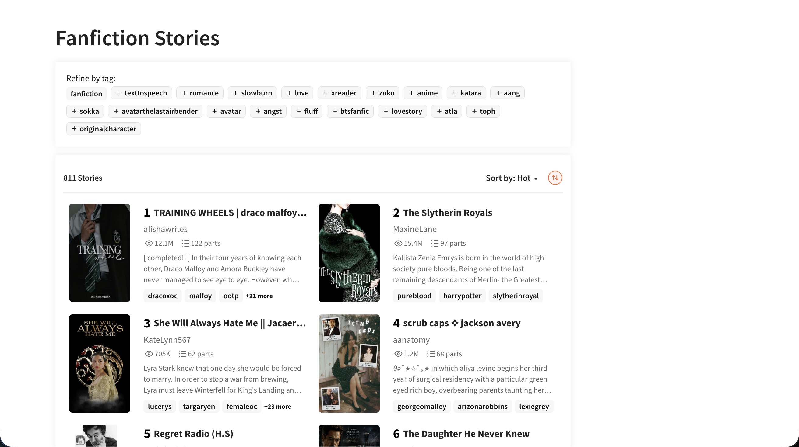
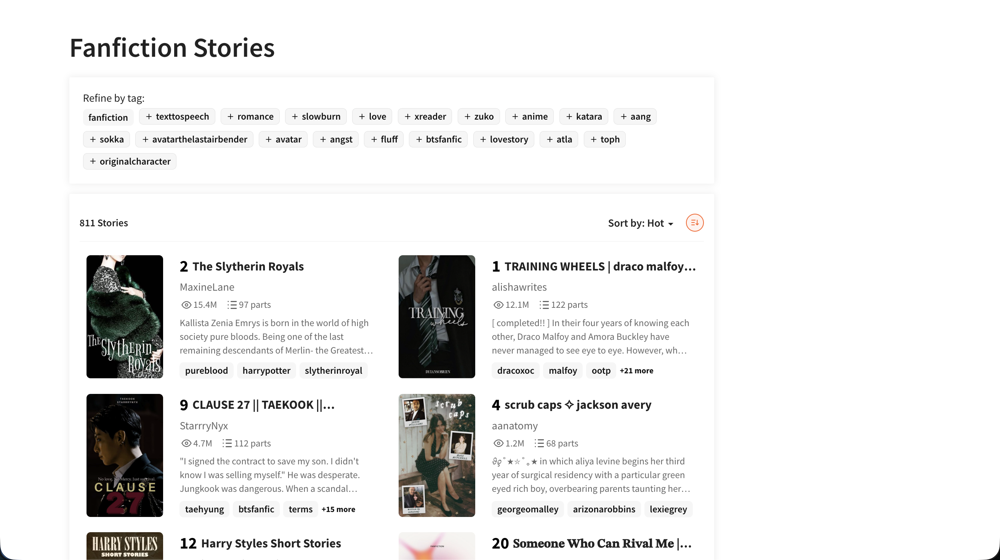
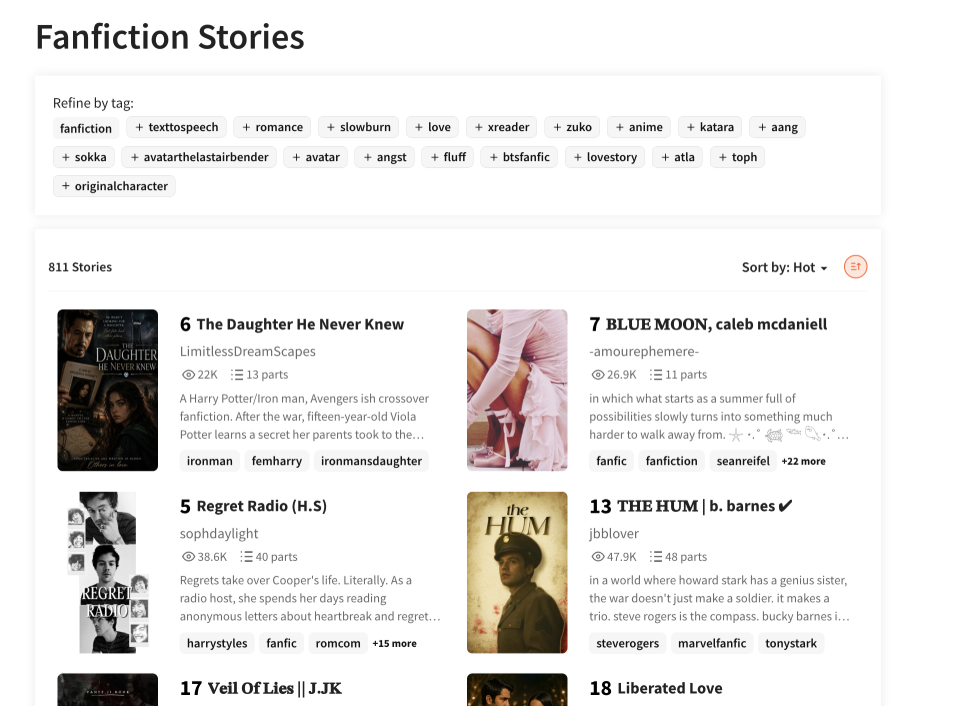

# Wattpad Views Sorter

`wattpad-sorter` is a Chrome extension that allows users to sort Wattpad stories by view count ascending or descending. Wattpad only supports viewing stories by "Hot" and "New". This extension parses view counts for each story directly from the DOM and reorders in place, with no API calls and no page reloads.

## Install

---

**Requirements:** Chrome 88+ (Manifest V3)

1. Clone this repository
2. Open Chrome and go to `chrome://extensions`.
3. Enable Developer mode.
4. Click "Load unpacked" and select this folder.
5. Open Wattpad and navigate to any page with story cards.
6. Navigate to any Wattpad story list — the **⇅** button will appear next to the sort dropdown.

## Features

---

The toggle button cycles through three states:

| Icon | State      | Behaviour                                    |
| ---- | ---------- | -------------------------------------------- |
| ⇅    | Neutral    | No sorting applied — Wattpad's default order |
| ↓    | Descending | Most-read stories first                      |
| ↑    | Ascending  | Least-read stories first                     |

Click the button to cycle. Note that sorting is applied on top of Wattpad's built-in Hot and New pages. So if sorting by view count descending (most-read stories first), then this will only show stories that already exist in Hot or New, not every story with a given tag.

## Example Usage

Neutral Sort:

Desc Sort (most viewed first):

Asc Sort (least viewed first):

## Architecture

> *TODO: architecture diagram*

---

## How it works

Wattpad is a React SPA. Changing sort order or navigating between pages tears down and remounts parts of the DOM rather than doing a full page reload, which makes persistent UI injection tricky.

The extension handles this with two independent background processes:

- `MutationObserver` watches for newly added story cards as they lazy-load and indexes them immediately.
- `setInterval` **at 200ms** checks whether the toggle button is still in the DOM and re-injects it if React has wiped it. This sidesteps React's multi-pass render cycle, where a mutation-based approach would lose a race against the second render pass.

Sorting itself is pure DOM manipulation — `appendChild` on an existing node moves it rather than cloning it, so reordering the card list requires no node creation.

## Development

---

**To reload after local changes:**

1. Go to `chrome://extensions`.
2. Click the refresh icon on the Wattpad Views Sorter card.
3. Hard-refresh Wattpad (`Cmd+Shift+R` / `Ctrl+Shift+R`).

